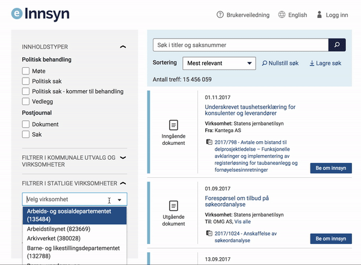



YAYA

## Søk
**Bruk: [https://test.einnsyn.no](https://test.einnsyn.no)**

***

Hvor mange dokumenter (journalposter finnes det) i løsningen?
 
 Svar: Ca. 12 millioner

***

Hvor mange dokumenter (journalposter finnes det) har DIFI?
 
 Svar: 26 917
 
 
 
***
 
 
"Riksarkivet Stab" er en undervirksomhet under Arkivverket. Hvem sender de post med?
 
 Svar: Kulturdepartementet
 

***

Sorterting er verdt å øve på. Kan du finne dokumentdato på det tidligst publiserte dokumentet?

Hint: Filtrer på Dokument. 

Hint: Sorter på eldste først. 

Hint: Velg datotype i DATOAVGRENSING (husk å trykke på "Vis datotype"

Svar: 01.01.2010

*** 
