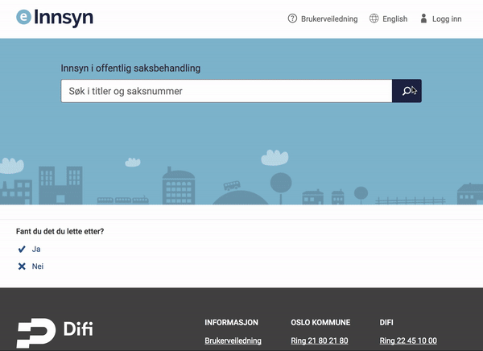



## Søk
**Bruk: [https://test.einnsyn.no](https://test.einnsyn.no)**

***

#### Hvor mange dokumenter (journalposter finnes det) i løsningen?
 
 Svar: Ca. 12 millioner

<video  controls style="width:100%">
  <source src="filtreringPåDokumentSak.webm" type="video/webm">
</video>

***

#### Hvor mange dokumenter (journalposter finnes det) har DIFI?
 
 Svar: 26 917
 
<video  controls style="width:100%">
  <source src="enkelFiltrering.webm" type="video/webm">
</video>
 
***
 
 
#### "Riksarkivet Stab" er en undervirksomhet under Arkivverket. Hvem sender de post med?
 
 Svar: Kulturdepartementet
 
<video  controls style="width:100%">
  <source src="dypFiltrering.webm" type="video/webm">
</video>

***

#### Sorterting er verdt å øve på. Kan du finne dokumentdato på det tidligst publiserte dokumentet?

Hint: Filtrer på Dokument. 

Hint: Sorter på eldste først. 

Hint: Velg datotype i DATOAVGRENSING (husk å trykke på "Vis datotype"

Svar: 01.01.2010

***
#### Søke på nynorsk ord

Prøv feks.

 - tilskudd / tilskot
 - annerledes / annleis
 - antakelig / truleg (merk at stemming ikke fungerer her)

<video  controls style="width:100%">
  <source src="Kapture 2018-01-17 at 12.16.58.webm" type="video/webm">
</video>

*** 

#### Søke på saksnummer

Man kan søke på saksnummer på formatet "år/sekvensnummer" eg. 2017/297

Søket gir ofte mange treff, så filtrering på virksomhet er lurt.

Det er også mulig å søke på to-siffer for år, eg. 17/297

Vi støtter ikke ledende 0 eller andre tegn, men det er planlagt for fremtiden. Da vil man kunne søke på 2017/0297 og kanskje 2017/0297-1 (for dokument).

<video  controls style="width:100%">
  <source src="søkPåSaksnummer.webm" type="video/webm">
</video>

***

#### Søke med *

Søk med stjerne er mulig på slutten av et ord. Det fungerer ikke for * først, eller for * inni ord. Det er maks 3 stjerner.

<video  controls style="width:100%">
  <source src="stjerneSøk.webm" type="video/webm">
</video>

***

#### Søke med "eller" og "minus"

Søk er "og" som standard. Man kan bruke | for å søke på to ord selv om de ikke forekommer i samme dokument.

<video  controls style="width:100%">
  <source src="ellerSøk.webm" type="video/webm">
</video>

Hvis man får for mange treff, så kan man redusere søket ved å fjerne ord. Feks: bistand systemutvikling -midlertidig -soa -tilbud -avrop

Husk at det ikke skal være mellomrom etter -

Det er også viktig å vite at detter fungerer dårlig på tvers av dokument og saksmappe.

<video  controls style="width:100%">
  <source src="fjerneTreff.webm" type="video/webm">
</video>

***

#### Info om spesialtegn i søk

Hvor finner man mer info om spesialtegn? 

Trykk på "Om eInnsyn" øverst og velg "Brukerveiledning".

[https://test.einnsyn.no/informasjon/brukerveiledning](https://test.einnsyn.no/informasjon/brukerveiledning)

***

## Sluttbruker
**Bruk: [https://test.einnsyn.no](https://test.einnsyn.no)**

***

#### Prøv å opprett en bruker.

Gå til [https://www.mailinator.com](https://www.mailinator.com) for å få en ny epost.

Forslag til passord: Passord123!

<video  controls style="width:100%">
  <source src="opprettBruker.webm" type="video/webm">
</video>

***

#### Gjør et søk og lagre søket. Kan du finne det igjen i Mitt eInnsyn?

Hva gjør abonnere på søk? Da får du epost når det kommer nye treff i søket ditt. Du kan melde deg av på Mitt eInnsyn.

<video  controls style="width:100%">
  <source src="lagreSøk.webm" type="video/webm">
</video>

***

#### Gå inn på en sak (eller trykk på saken fra et dokument). Lagre saken.l

<video  controls style="width:100%">
  <source src="lagreSak.webm" type="video/webm">
</video>

***

#### Opprette et innsynskrav

<video  controls style="width:100%">
  <source src="innsynskrav.webm" type="video/webm">
</video>
***

#### Endre status på innsynskrav selv

Status oppdaterer seg ikke automatisk. Men brukere kan endre statusen på innsynskravene manuelt i løsningen. De kan se tidligere statuser. 

Sortering og filtrering på status fungerer ikke i dagens løsning.

Merk, det er mulig å "ødelegge" innsynskravene ved å endre status for raskt, slik at løsningen mister oversikt over rekkefølgen. Det er ikke noen enkel måte å fikse det på.

<video  controls style="width:100%">
  <source src="innsynskravStatus.webm" type="video/webm">
</video>
***

#### Opprette et innsynskrav anonymt

Husk å logge ut

<video  controls style="width:100%">
  <source src="innsynskravAnonymt.webm" type="video/webm">
</video>
***